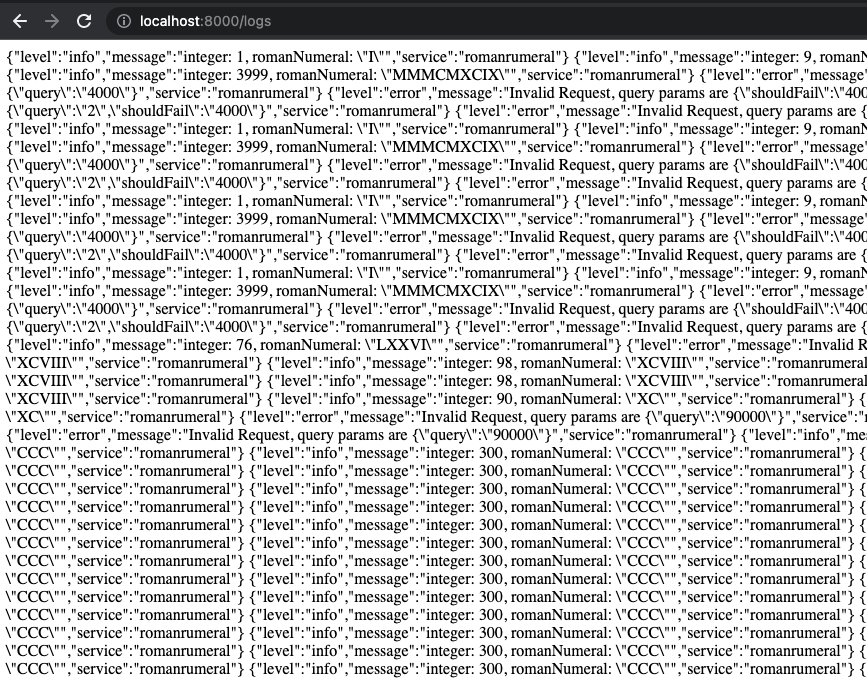
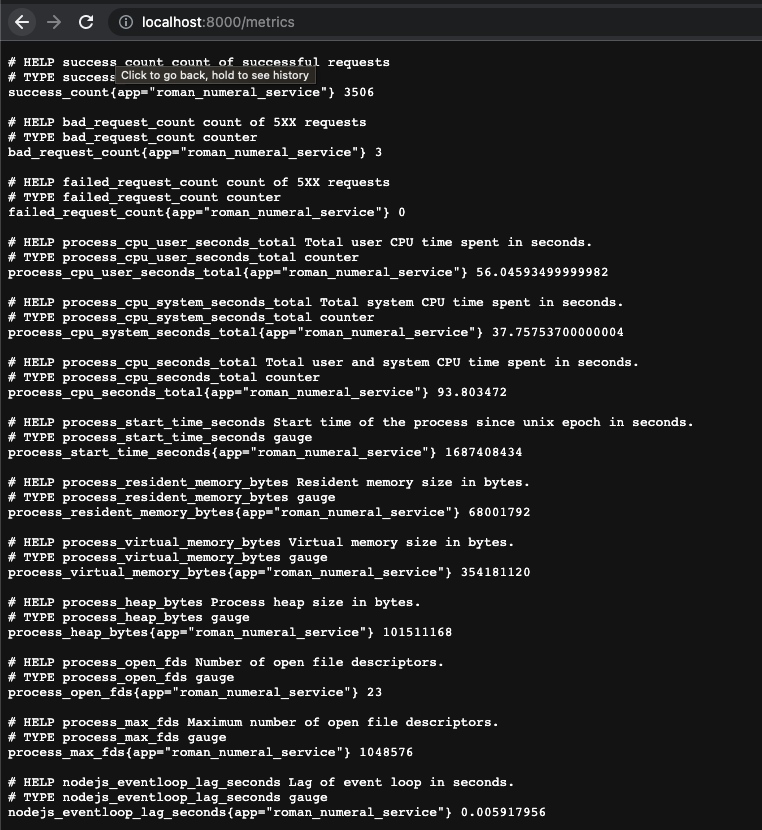
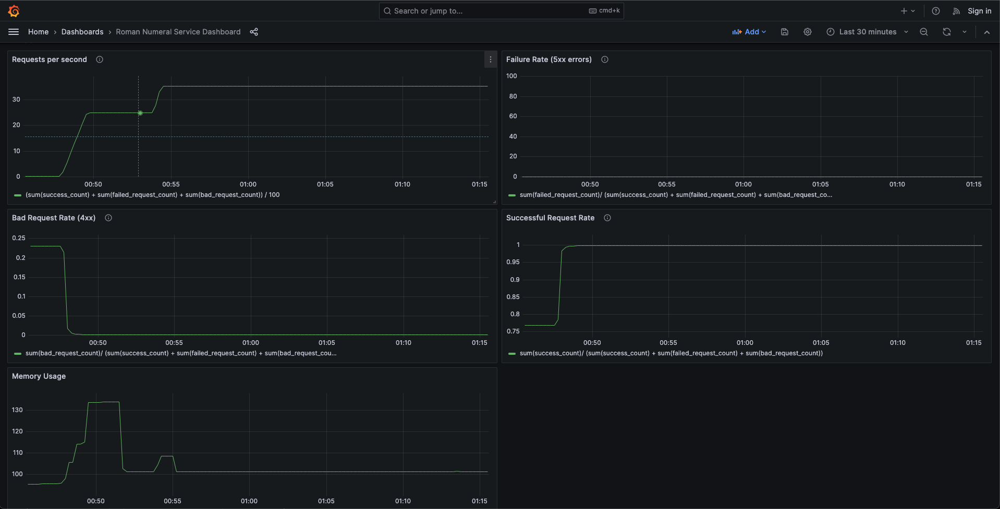

# Roman Numeral Service

This is simple web service using Node.js and Express, which converted a given integer between 1 and 3999 to a roman numeral digit.


## Deployment

To deploy this project locally without using Docker run

```
  npm install
```

```
  npm run serve 
```
(this will also run the unit tests)

The application should start running on `localhost:8000`


### Deploy locally using docker-compose

To deploy the server in a Docker container 


```
  docker compose up (on Mac)
  docker-compose up (Linux and Windows)
```

This should create and start 4 containers, one for each of the following
- romannumeral service
- cAdvisors
- Prometheus
- Grafana

Once the `docker compose up` command is successful, you should be able to run the application on `localhost:8000`


## API Reference

#### Convert integer to roman numeral value

```http
  GET /romannumeral?query={query}
```

| Parameter | Type     | Description                |
| :-------- | :------- | :------------------------- |
| `query` | `string` | **Required**. A number between 1 and 3999 |

#### Sample request

```
GET /romannumeral?query=9
```

#### Sample response

```
{
  "input":"9"
  "output:"IX"
}
```

> If the number is out of bounds or any additional query parameters are passed, the API returns
and 400 Bad Request response.

#### Get Application Logs

```http
  GET /logs
```

This endpoint will display the application level logs for the service.




#### Get Metrics

```http
  GET /metrics
```



This endpoint will display the application level metrics. Eg. `success_count` `bad_request_count` `failed_request_count`. 

This endpoint is used to to ingest metrics to Prometheus, which will then be the datasource for the metric graphs in Grafana.


#### View Prometheus Metrics 

```http
  GET localhost:9090
```

This will take you to the Prometheus dashboard, where we can search for various metrics that are available.


```http
  GET localhost:3000
```

This will take you to the Grafana dashboard, which we can use to create cool metric graphs from metrics from Prometheus. These were the graphs I created from the custom metrics.




## Development and Testing Methodology

Please refer to the [pull requests here](https://github.com/ksravista/roman-numeral-webservice/pulls?q=is%3Apr). This will show the steps I have taken from setting up the project to adding incremental functionality, while including unit tests wherever I can.

- First I setup the initial package describing the choice of the frameworks like Node, Express, Jest - [Pull Request](https://github.com/ksravista/roman-numeral-webservice/pull/1)
- Then I added testing as part of the build process with this [small change](https://github.com/ksravista/roman-numeral-webservice/pull/2)
- Then I added a util function with unit tests which will be used by the API to convert an integer to a Roman Numberal - [Pull Request](https://github.com/ksravista/roman-numeral-webservice/pull/3)
- Then I seperated the routes to separate files, so that the packaging layout is extensible and easy to read - [Pull Request](https://github.com/ksravista/roman-numeral-webservice/pull/4) 
- Then I added linting and prettier to enforce a particular code style. This should have been one of the first pull requests - [Pull Request](https://github.com/ksravista/roman-numeral-webservice/pull/5)
- Added happy path functionality to the API route along with unit tests. [Pull Request](https://github.com/ksravista/roman-numeral-webservice/pull/6)
- Then I added the edge cases and error handling in the follow-up PR, with unit tests. [Pull Requests](https://github.com/ksravista/roman-numeral-webservice/pull/7)
- At this point, the service is functionally complete, so then I added a Dockerfile to containerize the service so it can be deployed easily in production. [Pull Request](https://github.com/ksravista/roman-numeral-webservice/pull/8)
- To make the service more maintainable and be able to identify any issues, I added logging to the service. [Pull Request](https://github.com/ksravista/roman-numeral-webservice/pull/9)
- Then I started to think about metrics for the service, and decided to use Prometheus as it is an open source metrics collection framework with several resources online to pick up easily. In this step, I also added the `docker-compose` file as this would make the deployment of multiple containers easy. [Pull Request](https://github.com/ksravista/roman-numeral-webservice/pull/10)
- Since the metrics collection framework was setup, I need to Prometheus client in order to record application level metrics like success_count, failed_request_count, etc. So in this [pull request](https://github.com/ksravista/roman-numeral-webservice/pull/11) I added the `prom-client` for Node.js.
- This is the last major change, which will have the functionality to record the metrics, configure the Prometheus instance to read from the `/metrics` API. In this pull request I also added configuration to run Grafana, allowing me to look at and create cool metric graphs from data from Prometheus. [Pull Request](https://github.com/ksravista/roman-numeral-webservice/pull/12)


## Package Layout

- [**dist**](dist) - transpiled javascript code from typescript
    - [**src**](dist/src) - is a mirror of src directory below.
        
- [**grafana**](grafana) - Grafana specific configurations for the Granfana container
    - [**data**](grafana/data) - This is where Grafana will stores the local db.
    - [**provisioning**](grafana/provisioning)
        - [**dashboards**](grafana/provisioning/dashboards) - dashboard configuration
        - [**datasources**](grafana/provisioning/datasources) - this is where Prometheus datasource is configured for Grafana to pull metrics from Prometheus
- [**prometheus**](prometheus) - contains the YAML configuration for the Prometheus docker container
- [**src**](src) - High level directory with all the application logic
    - [**config**](src/config) - Stores any static config values like PORT number, etc
    - [**constants**](src/constants) - Stores API constants, integerToRoman mapping
    - [**errors**](src/errors) - Folder for custom exceptions
    - [**logger**](src/logger) - Logger specific config information to abstract that from the rest of the application.
    - [**routes**](src/routes) - Routes for the various APIs
        - [**logging**](src/routes/logging) - Logging specific routes and handlers
        - [**metrics**](src/routes/metrics) - Metrics specific routes and handlers.
        - [**romannumeral**](src/routes/romannumeral) - roman numberal API speific routes and handlers
    - [**utils**](src/utils) - Can contain various util/helper functions
- [**test**](test) - Testing
    - [**routes**](test/routes) - tests speficic to the routes
    - [**utils**](test/utils) - **tests specific to the utils. This is where the helper function to convert an integer to roman numeral string is**
## Dependencies

- **Jest** - A widely used unit testing frameworks which provides various functionality like mocking and spying 
- **Express** - Lightweight Node.js web application frameworks to create REST APIs
- **es-lint** - Used to enforce a coding style and to identify any problematic issues in code through static code analysis.
- **prom-client** - prometheus client for Node.js, which is used to record and collect application level metrics.
- **Winston** - A popular logging framework for Node.js, which supports multiple transports, meaning that the logs can be redirected to multiple destinations. In this service, the logs are directed to a log file, but in a production enviroment it is helpful to also store the logs in a centralized location in case an instance of the service has an outage.
- **Supertest** - A lightweight testing tool, which can used to test express routes in unit tests, without having to mock the various asynchrous response object in express. This provides an abstraction and allows us to just test the response from the API rather than how the response object is called. 

### Resources

- https://github.com/winstonjs/winston
- https://grafana.com/docs/grafana/latest/getting-started/get-started-grafana-prometheus/
- https://prometheus.io/
- https://github.com/google/cadvisor 

